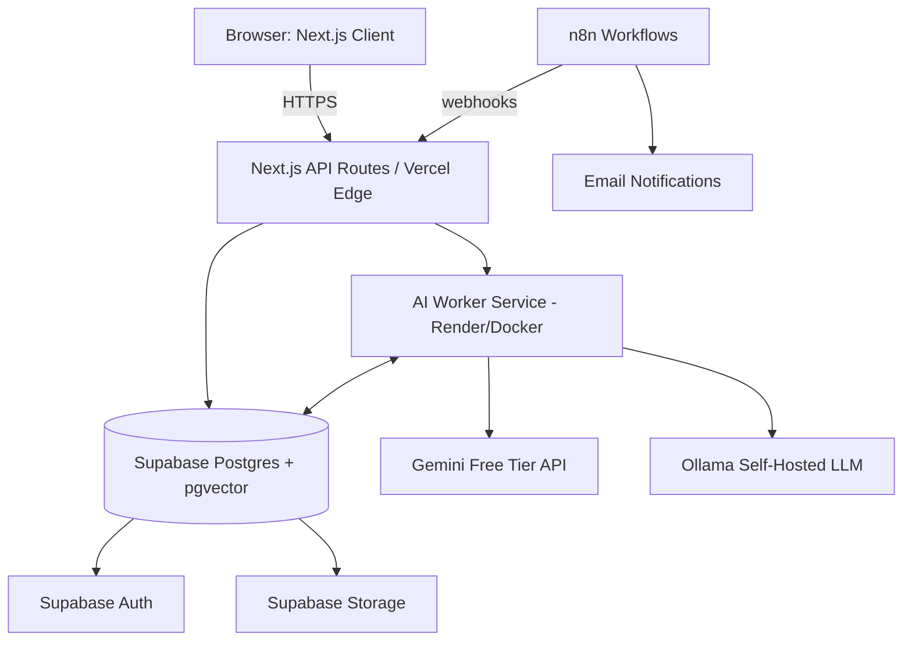

# Bidently
### AI-Powered Bid, Tender & Proposal Intelligence Platform

> **One-line pitch:** Bidently reads a 150-page tender in minutes, tells your team exactly what it takes to qualify, and drafts a compliant first-response proposal from your company's own past work — so your best people spend their time closing deals, not reformatting boilerplate.

| | |
|---|---|
| **Document type** | Flagship SaaS portfolio blueprint |
| **Budget constraint** | $0 — 100% free/open-source infrastructure |
| **Buildable by** | One solo developer |
| **Primary markets** | Pakistan (PPRA & provincial public tenders, IT/export sector, construction) + Global B2B (RFPs, government contracts, enterprise procurement) |

---

## Table of Contents

**Idea Evaluation** — how Bidently was chosen over four other real candidates

1. Product Name · 2. Elevator Pitch · 3. The Business Problem · 4. Target Customers · 5. Why Businesses Would Pay · 6. Market Size & Demand · 7. Key Differentiators · 8. Complete Feature List · 9. AI Features · 10. Automation Features · 11. System Architecture · 12. Database Design · 13. Tech Stack · 14. Folder Structure · 15. API Architecture · 16. UI/UX Plan · 17. Authentication Strategy · 18. Deployment Plan · 19. Free Hosting Strategy · 20. Security Considerations · 21. Scalability Plan · 22. Monetization Strategy · 23. Future Premium Features · 24. Portfolio Presentation Strategy · 25. Why This Wins Fiverr & Upwork Clients · 26. Bonus: Suggested Build Roadmap

---

## Idea Evaluation — The Founder's Lens

Five ideas made the shortlist. All five solve a real, expensive problem and are technically buildable for free — that's the minimum bar. What separates the winner is total addressable market, evidence that companies already pay for this category, and whether the AI is genuinely load-bearing or just decorative.

| Idea | Mkt Demand | Biz Value | Global | Pakistan Fit | AI Use | Feasibility* | Portfolio | SaaS Pot. | Revenue | Wow | **Avg/10** |
|---|:-:|:-:|:-:|:-:|:-:|:-:|:-:|:-:|:-:|:-:|:-:|
| **Bidently** — AI bid/tender/RFP intelligence | 9 | 10 | 9 | 9 | 10 | 8 | 10 | 9 | 9 | 10 | **9.3** |
| ClearCargo — HS code & customs duty AI assistant | 7 | 8 | 7 | 8 | 7 | 7 | 7 | 7 | 7 | 7 | 7.1 |
| TradeShield — LC/export-document discrepancy checker | 7 | 8 | 6 | 9 | 7 | 7 | 7 | 6 | 6 | 7 | 7.0 |
| AuditReady — buyer-compliance & audit-readiness tracker | 6 | 7 | 5 | 8 | 6 | 6 | 6 | 6 | 6 | 6 | 6.2 |
| ScopeGuard — scope-creep & change-order automation | 6 | 7 | 7 | 6 | 6 | 6 | 6 | 6 | 5 | 6 | 6.1 |

*Feasibility = appropriately challenging to prove real engineering skill, while still realistically shippable solo on free infrastructure.

**Verdict:** Bidently is the only idea that clears the 9/10 bar. It has the largest addressable market by a wide margin, the clearest proof that companies already pay real money for this category, and an AI layer that is genuinely load-bearing — remove the AI and there's no product left, unlike a chatbot bolted onto a CRUD app. The other four are legitimate SaaS ideas worth building later (TradeShield and ClearCargo especially — strong "phase 2" candidates once Bidently is generating case studies), but they're narrower verticals with smaller ceilings.

---

## 1. Product Name

**Bidently**
*"Forge winning bids, faster."*

Alt. names considered: TenderMind, WinRoom, BidPilot. Bidently won because "Forge" signals craftsmanship/engineering (useful for a portfolio narrative) and the name works in both "bid" (US/global RFP terminology) and "tender" (Pakistan/UK/Commonwealth terminology) markets without alienating either.

*Before committing commercially: run a 5-minute trademark and domain check (bidently.com/.io and your target country's trademark register) — this blueprint doesn't include that check.*

---

## 2. Elevator Pitch

> Bidently is an AI-powered bid and proposal intelligence platform that helps companies win more RFPs, tenders, and government contracts in a fraction of the time. It reads lengthy, inconsistent bid documents and automatically extracts every requirement, eligibility rule, and compliance checkpoint. It then matches each requirement against a company's own library of past proposals, certifications, and case studies, and drafts a compliant first-response answer — grounded and traceable back to source material, never invented. What used to take a bid team three to five days of manual reading and rewriting now takes a few hours of review and polish, while a compliance matrix protects them from the single missed requirement that gets a technically excellent bid disqualified on a technicality.

---

## 3. The Business Problem

Any company that wins revenue through competitive bidding — IT services, construction/EPC, consulting, manufacturing, logistics, agencies — runs into the same structural problem:

- **Bid documents are long and inconsistent.** Government tenders and enterprise RFPs routinely run 50–300+ pages, mixing technical specs, eligibility criteria, legal boilerplate, and submission mechanics, with no two issuing bodies formatting them the same way.
- **The work is a hidden tax on your best people.** Bid managers, senior engineers, and finance leads spend days per proposal manually extracting requirements, building compliance checklists by hand, hunting through old Word docs for a case study that fits, and rewriting near-identical answers for the tenth time this quarter.
- **One missed line item can void weeks of work.** A missing certification, an unaddressed evaluation criterion, or a page-limit violation can technically disqualify a bid regardless of how strong the actual proposal is — the cost of the mistake is the entire sunk effort, not just the missed item.
- **The good tools are priced for enterprises, not for the companies that need them most.** Established proposal-automation platforms serve large enterprises with dedicated bid teams and five- and six-figure annual budgets. Small and mid-sized firms — which describes the vast majority of companies bidding on public tenders in Pakistan and similar markets — are left with Word, Excel, email threads, and whatever the last bid manager remembered before they left the company.

The result: smaller, capable companies structurally lose bids to larger competitors not because their solution is worse, but because their proposal process is slower and less compliant.

---

## 4. Target Customers

**Primary ICP:** organizations of roughly 10–500 employees that bid regularly (monthly or more) and don't yet have a dedicated, tooled-up bid function.

| Segment | Why they bid | Pakistan relevance |
|---|---|---|
| IT & software services firms | Enterprise/government digitization contracts, telco & bank RFPs | Very high — Pakistan's fastest-growing export sector |
| Construction, EPC & infrastructure contractors | Public/private tenders (PPRA, PPRA-Punjab, SPPRA and equivalents abroad) | Very high — PPRA-regulated tendering is mandatory for public works |
| Management/engineering consulting firms | RFPs from corporates, donors, government | High |
| Manufacturers & industrial suppliers | Corporate procurement RFPs, government supply contracts | Medium-high |
| Logistics & freight companies | Corporate/government logistics tenders | Medium |
| Marketing/creative/digital agencies | Enterprise client RFPs | Medium |
| NGOs & development-sector orgs (expansion segment) | Donor RFPs, grant solicitations | Medium — Pakistan has a large NGO/INGO sector |

**Buyer persona:** Bid Manager, BD/Proposals Director, or — at smaller firms — the founder/CEO directly writing bids the night before a deadline.

---

## 5. Why Businesses Would Pay

- **The ROI math is absurd in the buyer's favor.** One additional contract won because a proposal was faster and more compliant can be worth 10–1,000x an annual subscription. Buyers evaluate this as "insurance on our win rate," not as a line-item software cost.
- **Time saved is a hard-dollar labor cost.** A bid manager's fully-loaded day rate × hours saved per proposal × number of proposals per year is a number finance teams can compute in a spreadsheet in front of you.
- **Risk reduction protects sunk cost.** Avoiding disqualification on a missed technicality protects the investment already made in a bid, not just future ones.
- **Institutional memory stops walking out the door.** A searchable, versioned content library means a company's best answers, certifications, and case studies survive employee turnover — a real and painful problem at proposal-heavy firms.
- **Competitive parity with larger rivals.** SMEs get enterprise-grade proposal capability without hiring an enterprise-sized bid team or paying enterprise software prices.

---

## 6. Market Size & Demand

Independent market-research firms don't agree on exactly how to draw the category boundary — narrowly-scoped "RFP software" estimates land anywhere from roughly $0.4–$1.6 billion in 2026, while the broader "proposal management software" category (the more accurate comparison for Bidently) is estimated at roughly **$3.6 billion in 2026, heading toward $9+ billion by the early 2030s**, growing at a low-double-digit compound annual rate. Every estimate agrees on direction: this is a multi-billion-dollar, double-digit-growth category, not a niche.

What matters more than the exact number is *who's already in it and why*: established players like Loopio, Responsive, PandaDoc, and Qvidian (Upland Software) built durable, high-retention businesses selling exactly this workflow to enterprise bid teams — and in just the last year or two, a wave of AI-native challengers (Arphie, AutoRFP.ai, Bidara, Docket, Tribble.ai, Conveyor, Ombud) has entered specifically because AI extraction and drafting made the category newly attractive to build in and newly affordable to serve down-market. That second wave is direct proof of the exact wedge Bidently is built on: AI-native, fast time-to-value, priced for companies smaller than the Fortune 500.

**Pakistan-specific demand is unusually strong right now:**
- Pakistan's IT and IT-enabled-services exports hit a record **~$4.5–4.6 billion in FY2025–26**, up roughly 20–29% year-on-year, with government policy (including a preferential tax regime for IT exporters running through 2029) actively pushing the sector toward a $5 billion, then $10 billion, target. Every one of those exporting software houses eventually bids on enterprise and government contracts, domestically and abroad.
- Public procurement in Pakistan is a permanent, growing, *digitizing* fixture of doing business: PPRA (federal) and provincial authorities (PPRA-Punjab, SPPRA in Sindh, and equivalents) are actively rolling out e-procurement systems like EPADS, standardizing bidding documents, and pushing every government-facing vendor toward structured, compliance-heavy tendering — precisely the workflow Bidently automates.
- Construction/EPC, textile/export manufacturing, and telecom sectors all run heavily on tender-based revenue in Pakistan, and none currently have access to affordable, AI-assisted bid tooling.

*(Market-size figures above are rounded estimates synthesized from multiple analyst reports, which vary in methodology — treat them as directional, not precise.)*

---

## 7. Key Differentiators

**vs. legacy proposal software (Loopio, Responsive, Qvidian):** AI-native from day one instead of AI bolted onto a 2015-era content-management workflow; a fraction of the price; designed to deliver value on the *first* bid instead of requiring weeks of content-library setup before it's useful, because the AI can bootstrap the library from a company's past proposal documents.

**vs. generic AI chatbots (ad hoc ChatGPT use):** Bidently understands document structure and produces a structured, trackable compliance matrix — not a wall of prose. It maintains a persistent, versioned, company-specific content library. Every AI answer is grounded and cites the source content it was built from, so a human can verify it in seconds instead of trusting a black box.

**vs. the manual process (Word, Excel, email, tribal knowledge):** Full audit trail, real collaboration, automatic compliance tracking, and a knowledge base that survives staff turnover.

**Local-to-global fit:** Built to parse both PPRA-style Pakistani tender documents and international RFP formats out of the box — a genuine "works everywhere" claim most competitors, built enterprise-first for the US/EU market, can't credibly make.

**Not a CRM wearing an AI badge:** the core IP is the document-intelligence and retrieval-augmented generation pipeline, not another set of CRUD screens. The lightweight opportunity tracker exists to support the compliance workflow, not to compete with Salesforce.

---

## 8. Complete Feature List

**Workspace & Team**
- Multi-tenant organizations with row-level data isolation
- Roles: Owner/Admin, Bid Manager, Contributor, Reviewer, read-only Client Viewer
- Invite flow, seat management

**Document Intake**
- Drag-and-drop upload (PDF, DOCX, scanned/image PDFs)
- OCR fallback for scanned government tenders
- Bulk upload; paste-in text for portal-copied tenders

**AI Requirement Extraction**
- Structured extraction of mandatory requirements, eligibility criteria, evaluation weightings, and submission mechanics (deadline, format, page limits, required annexes)
- Auto-categorization: technical / financial / legal / administrative

**Compliance Matrix**
- Auto-generated checklist mapped back to source page/clause
- Status tracking (Not Started / In Progress / Complete / N/A), assignment, progress dashboard

**Content Library (RAG source)**
- Reusable "answer blocks": case studies, certifications, team bios, methodology sections, pricing templates
- Tagging, versioning, semantic search

**AI Draft Generation**
- For each requirement, retrieves the best-matching library content and drafts a tailored, source-grounded first answer
- Inline editing, approval workflow

**Win-Theme & Gap Analysis**
- Flags requirements with no matching content ("content gap") before they become a scramble
- Historical win/loss pattern surfacing

**Collaboration & Review**
- Threaded comments, version history, section-level locking, redline-style review

**Export**
- Branded, compliant DOCX/PDF export matching submission formatting rules

**Analytics**
- Win rate, average time-per-proposal, compliance completion trends, most-reused content, pipeline value forecast

**Deadline & Task Automation**
- Auto-created task list from extracted deadlines, reminders, ICS calendar export

**Opportunity Tracking**
- Lightweight pipeline view (Identified → Go/No-Go → In Progress → Submitted → Won/Lost) built around the bid workflow — not a standalone CRM

**Go/No-Go Decision Support**
- AI-assisted fit scoring for a new tender against company profile and past win patterns, so teams stop burning weeks on long-shot bids

**Multi-language Support**
- Basic Urdu-language tender extraction alongside English (differentiator for the Pakistani market)

---

## 9. AI Features

AI is the product, not a feature bolted onto one. Every AI output in Bidently is **grounded and traceable** — the system never free-generates an answer without pointing back to the source text or library content it came from, because in this domain a hallucinated compliance answer is worse than no answer at all.

- **Document understanding & structured extraction** — an LLM call with a strict output schema pulls requirements out of unstructured tender text as structured data, not prose:

```json
{
  "requirement_text": "verbatim or near-verbatim from source",
  "category": "technical | financial | legal | administrative",
  "source_page": 14,
  "is_mandatory": true,
  "evaluation_weight": 15,
  "keywords": ["ISO 9001", "local presence"]
}
```

- **Retrieval-Augmented Generation (RAG)** — content-library items are embedded and stored in a vector column (pgvector via Supabase); each requirement triggers a semantic search for the best-matching past content before any drafting happens.
- **Grounded draft answers** — generated text cites which library entries it drew from, so reviewers verify in seconds instead of fact-checking from scratch.
- **Compliance gap detection** — flags requirements with no matching content so gaps surface on day one of a bid, not the night before submission.
- **Go/No-Go fit scoring** — a lightweight scoring model combining tender features (value, sector, deadline runway) with the org's historical win/loss data.
- **Win/loss pattern summarization** — LLM-assisted qualitative synthesis across a company's own historical bids ("proposals emphasizing local delivery teams performed better in Sector X" style insights, generated from the org's *own* data, not industry-wide claims).
- **OCR + layout-aware parsing** for scanned tenders (common with older Pakistani government documents) using open-source OCR.
- **Dual AI backend by design, not by accident:** Gemini's free tier (Flash/Flash-Lite models) handles default extraction and drafting at zero cost; a self-hosted Ollama model is available as a drop-in alternative for confidentiality-sensitive tenders. This matters more than it sounds — Google's free-tier terms currently permit using free-tier prompts to help improve their models, which is a legitimate non-starter for a government tender under an NDA. Offering a fully local, on-premise processing option is a genuine enterprise-security selling point, not just a cost hedge.

---

## 10. Automation Features

- Auto-extraction of submission deadlines → task list + calendar (ICS) generation
- n8n workflow: new tender uploaded → team notified (email/Slack-compatible webhook) → extraction job triggered → tasks created
- n8n workflow: deadline reminders at configurable intervals before submission
- Auto-formatted DOCX/PDF export matching a saved brand/submission template
- Post-decision retrospective prompt: marking a bid Won/Lost triggers an automatic prompt for a short retro note, feeding the win/loss pattern engine

---

## 11. System Architecture

```
┌──────────────────────────────────────────────────────────────┐
│                     CLIENT (Browser)                          │
│         Next.js App — React + TypeScript + Tailwind           │
└───────────────────────────┬────────────────────────────────────┘
                             │ HTTPS
                             ▼
┌──────────────────────────────────────────────────────────────┐
│         Vercel Edge — Next.js API Routes / tRPC               │
│     Supabase JWT auth check · request validation               │
└───────────┬──────────────────────────────────┬──────────────────┘
            │                                  │
            ▼                                  ▼
┌────────────────────────┐        ┌──────────────────────────────┐
│  Supabase Postgres       │◄──────►│   AI Worker Service (Render)  │
│  Row-Level Security       │  job   │   Docker · Node/Python         │
│  + pgvector embeddings    │  queue │   OCR · Extraction · RAG        │
│  Supabase Auth / Storage  │        │   Draft generation               │
└────────────────────────┘        └───────────┬──────────────────┘
            ▲                                  │
            │ triggers/webhooks                ▼
┌────────────────────────┐        ┌──────────────────────────────┐
│  n8n (self-hosted,       │        │  Pluggable AI providers        │
│  Render/Docker)           │        │  • Gemini free tier (default)  │
│  Reminders · Notifications│        │  • Ollama (self-hosted/private)│
└────────────────────────┘        └──────────────────────────────┘
```



**Design decisions worth defending in an interview:**
- Heavy work (OCR, embedding, generation) is decoupled into a separate worker service so a slow AI call never blocks the main request path or the Next.js server.
- Multi-tenancy is enforced at the database layer (Postgres RLS scoped to `org_id`), not just in application code — a second line of defense if an API route has a bug.
- The AI provider is pluggable by design (Gemini vs. Ollama), which is both a cost-control lever and a security/compliance feature.

---

## 12. Database Design

*Simplified illustrative schema — a real migration would add indexes, constraints, and cascade rules.*

```sql
-- Tenants
organizations (
  id UUID PK, name TEXT, plan_tier TEXT, region TEXT, created_at TIMESTAMPTZ
)

-- Users
users (
  id UUID PK, org_id UUID FK -> organizations.id,
  email TEXT UNIQUE, full_name TEXT,
  role TEXT, -- owner/admin/bid_manager/contributor/reviewer/client_viewer
  created_at TIMESTAMPTZ
)

-- Tenders / opportunities
tenders (
  id UUID PK, org_id UUID FK,
  title TEXT, issuing_body TEXT,
  source_type TEXT, raw_file_url TEXT,
  status TEXT, -- identified/go_no_go/in_progress/submitted/won/lost
  estimated_value NUMERIC, submission_deadline TIMESTAMPTZ,
  go_no_go_score NUMERIC,
  created_by UUID FK -> users.id, created_at TIMESTAMPTZ
)

-- Extracted requirements
requirements (
  id UUID PK, tender_id UUID FK,
  category TEXT, requirement_text TEXT, source_page INT,
  is_mandatory BOOLEAN, evaluation_weight NUMERIC,
  status TEXT, assigned_to UUID FK -> users.id
)

-- Reusable content (RAG source)
content_library_items (
  id UUID PK, org_id UUID FK,
  title TEXT, body TEXT, tags TEXT[],
  embedding VECTOR(768), category TEXT, version INT,
  created_by UUID FK, updated_at TIMESTAMPTZ
)

-- AI-generated / human-edited answers
draft_answers (
  id UUID PK, requirement_id UUID FK,
  content TEXT, generated_by_ai BOOLEAN,
  source_content_ids UUID[], status TEXT, -- draft/in_review/approved
  last_edited_by UUID FK, updated_at TIMESTAMPTZ
)

comments (
  id UUID PK, entity_type TEXT, entity_id UUID,
  user_id UUID FK, body TEXT, created_at TIMESTAMPTZ
)

audit_log (
  id UUID PK, org_id UUID FK, actor_id UUID FK,
  action TEXT, entity_type TEXT, entity_id UUID,
  metadata JSONB, created_at TIMESTAMPTZ
)

subscriptions (
  id UUID PK, org_id UUID FK, plan TEXT, seats INT,
  status TEXT, renews_at TIMESTAMPTZ
)

notifications (
  id UUID PK, user_id UUID FK, type TEXT,
  payload JSONB, is_read BOOLEAN, created_at TIMESTAMPTZ
)
```

`embedding VECTOR(768)` assumes a 768-dimension open embedding model; swap the dimension to match whichever embedding model you settle on (Gemini's embedding models and several open Hugging Face models both work with pgvector).

---

## 13. Tech Stack

| Layer | Choice | Why |
|---|---|---|
| Frontend | Next.js (App Router) + TypeScript + Tailwind CSS + shadcn/ui | Fast to build, industry-standard, free |
| State/data | TanStack Query | Clean async state without boilerplate |
| Backend | Next.js API routes / tRPC for app logic; separate Node or Python service for AI workloads | Keeps heavy AI work off the web request path |
| AI — default | Google Gemini free tier (Flash/Flash-Lite) | $0 cost, generous enough for extraction + drafting at demo/early-usage scale |
| AI — private/fallback | Ollama, self-hosted (e.g., an open Llama-family model) | Zero marginal cost, keeps sensitive tender data fully on infrastructure you control |
| Embeddings | Gemini embeddings or an open Hugging Face embedding model | Powers the RAG content-matching |
| OCR | Tesseract (open-source) | Handles scanned/image-based tenders |
| Database | PostgreSQL via Supabase (free tier) + pgvector | Relational integrity + vector search in one database, no separate vector DB to run |
| Auth | Supabase Auth (email/password + Google/Microsoft OAuth) | Free, handles most business users' existing login habits |
| File storage | Supabase Storage (free tier) | Bundled with the DB/auth free tier |
| Automation | n8n, self-hosted via Docker | Free, visual workflow builder for reminders/notifications/integrations |
| Hosting — frontend | Vercel (Hobby for demo/portfolio phase) | Zero-config Next.js deploys |
| Hosting — worker/n8n | Render (free tier, Docker) | Persistent services Vercel isn't built for |
| DNS/CDN/SSL | Cloudflare (free) | Free SSL, edge caching, DDoS protection |
| CI/CD | GitHub Actions | Free for reasonable usage on public/private repos |
| Containerization | Docker | Packages the AI worker + n8n consistently |

---

## 14. Folder Structure

```
bidently/
├── apps/
│   ├── web/                     # Next.js frontend + API routes
│   │   ├── app/
│   │   │   ├── (marketing)/
│   │   │   ├── (auth)/
│   │   │   ├── (dashboard)/
│   │   │   │   ├── tenders/
│   │   │   │   ├── library/
│   │   │   │   ├── analytics/
│   │   │   │   └── settings/
│   │   │   └── api/
│   │   ├── components/
│   │   ├── lib/
│   │   └── hooks/
│   └── ai-worker/                # OCR, extraction, embeddings, generation
│       ├── src/
│       │   ├── extraction/
│       │   ├── embeddings/
│       │   ├── generation/
│       │   └── queue/
│       └── Dockerfile
├── packages/
│   ├── db/                       # Schema + migrations (Prisma or Drizzle)
│   ├── ui/                       # Shared shadcn/ui component library
│   └── types/                    # Shared TypeScript types
├── automation/
│   └── n8n-workflows/            # Exported n8n workflow JSON
├── docs/
└── docker-compose.yml
```

---

## 15. API Architecture

| Method | Endpoint | Purpose |
|---|---|---|
| — | `/api/auth/*` | Handled by Supabase Auth |
| POST | `/api/tenders` | Create a tender (upload source doc) |
| GET | `/api/tenders` | List org tenders, filterable by status |
| GET | `/api/tenders/:id` | Tender detail |
| POST | `/api/tenders/:id/extract` | Trigger AI requirement extraction job |
| GET | `/api/tenders/:id/requirements` | List extracted requirements |
| PATCH | `/api/requirements/:id` | Update status/assignment |
| POST | `/api/requirements/:id/generate-draft` | Trigger RAG draft generation |
| PATCH | `/api/draft-answers/:id` | Edit / approve a draft answer |
| GET/POST | `/api/library` | List / add content-library items |
| POST | `/api/library/:id/reindex` | Re-embed after an edit |
| GET | `/api/analytics/win-rate` | Win-rate & pipeline analytics |
| GET | `/api/analytics/content-usage` | Most-reused content items |
| POST | `/api/webhooks/n8n/deadline-reminder` | Inbound automation trigger |
| POST | `/api/tenders/:id/export` | Generate final DOCX/PDF |

Auth: Supabase-issued JWT bearer tokens on every request; Postgres RLS enforces org-scoping as a second layer even if an endpoint's own authorization check has a bug.

---

## 16. UI/UX Plan

**Design direction:** enterprise-clean and data-dense without feeling cluttered — closer to the visual register of Linear, Notion, or a Vercel dashboard than a generic admin template. This matters for the portfolio goal specifically: clients judge engineering competence partly through visual polish, fairly or not.

**Core screens:**
- **Dashboard** — pipeline overview, upcoming deadlines, KPI strip (win rate, active bids, compliance completion)
- **Tender workspace** — three-pane layout: original source PDF viewer | requirement/compliance list | draft answer editor, side by side so a human can verify every AI extraction against the source in one glance
- **Content Library** — searchable, tag-filtered, version history
- **Analytics** — win rate trends, time-per-proposal, most-reused content
- **Team settings** — roles, seats, billing

**A deliberate scoping decision:** heavy bid editing is a desktop activity in practice, so mobile gets a responsive dashboard/analytics view rather than full editing parity. Building "mobile-first bid writing" would burn build time on a use case that doesn't really exist — the kind of judgment call that reads well in a client conversation.

**Trust-by-design principle carried through the whole UI:** AI output is never presented as fact without a visible path back to its source (source page number, or linked library entry). This is both good product design and a defensible answer to "how do you stop it from hallucinating."

---

## 17. Authentication Strategy

- Supabase Auth: email/password + Google and Microsoft OAuth (covers most businesses already on Google Workspace or Microsoft 365)
- Multi-tenant orgs enforced via `org_id` in the JWT claim and matching Postgres RLS policies — a user's token literally cannot fetch another org's rows, even through a misconfigured API route
- Roles: Owner/Admin, Bid Manager, Contributor, Reviewer, plus an external Client Viewer role via an expiring, read-only shared link (useful for consortium/JV partners on large tenders)
- Optional TOTP-based MFA (Supabase supports this natively) — worth enabling and mentioning explicitly, since tender data is often commercially sensitive

---

## 18. Deployment Plan

1. Push code to a GitHub repo (monorepo as shown above)
2. Connect the repo to Vercel — auto-deploys the `apps/web` Next.js app on every push to `main`, with preview deployments per pull request
3. Create a Supabase project — Postgres, Auth, and Storage all provision together; enable the `pgvector` extension and apply RLS policies as part of the initial migration
4. Containerize `apps/ai-worker` and deploy it to Render as a Docker web service; deploy n8n as a second Render Docker service (or the same instance via docker-compose if keeping to one free service)
5. Point a custom domain through Cloudflare (free DNS + SSL + edge caching)
6. Store all secrets (Supabase keys, Gemini API key) as environment variables in Vercel/Render dashboards — never in the repo
7. Maintain separate `staging` and `main` branches once the app is stable enough to need one

---

## 19. Free Hosting Strategy

| Service | Free tier gives you (as of mid-2026) | The catch to plan around |
|---|---|---|
| **Vercel (Hobby)** | 100GB bandwidth, ~1M function invocations/edge requests, 6,000 build minutes/month | **Vercel's terms restrict Hobby to personal, non-commercial use.** Perfect for the portfolio/demo phase; the moment Bidently takes a real paying customer, budget $20/month for Pro (or move the frontend to a commercial-use-friendly free host). Flag this honestly in any client conversation — it's a real constraint, not a technicality to gloss over. |
| **Supabase (Free)** | 500MB database, 1GB file storage, 5GB egress, 50,000 monthly active users, 2 active projects, pgvector included | Free projects auto-pause after 7 days of complete inactivity — fine for a portfolio demo you occasionally ping, a real risk for a live customer who goes quiet over a holiday. A free scheduled GitHub Action or uptime-monitor ping avoids this. |
| **Render (Free)** | One free web service (spins down after ~15 min idle, 30–60s cold start), 750 free instance-hours/month | Good fit for the AI worker and n8n — background/async work tolerates a cold start much better than a customer-facing page would. Don't rely on Render's free Postgres for your main DB (Supabase already covers that), since the free Postgres instance there expires after 30 days. |
| **Cloudflare (Free)** | DNS, SSL, CDN/edge caching, basic DDoS protection | Effectively no catch at this scale |
| **Gemini API (Free)** | Flash/Flash-Lite models, roughly 15 requests/min and ~1,500 requests/day, no card required | Google's free tier terms currently allow prompts to be used to improve their models — a real reason to offer the Ollama fallback for confidential tender data, not just a cost consideration |
| **n8n (self-hosted)** | Unlimited workflows/executions by definition — it's your own container | Runs on the same Render free service as the AI worker to start |
| **GitHub Actions** | Free CI/CD minutes on public repos, a solid allowance on private ones | Watch minutes if the repo is private and builds get heavy |

**Bottom line:** every service above is genuinely free for building, demoing, and running a live portfolio instance. The one line worth saying out loud to a client — because it's the honest, senior-engineer thing to do — is that "commercial SaaS on entirely free infrastructure" has exactly one asterisk (Vercel's Hobby terms of service), and it costs $20/month to remove.

*(Free-tier terms change; the numbers above were verified in mid-2026 and are worth re-checking against each provider's pricing page before you architect around them.)*

---

## 20. Security Considerations

- **Tenant isolation** enforced at the database layer via Postgres Row-Level Security, scoped to `org_id` — not just an application-layer check
- **Encryption in transit** everywhere (HTTPS via Vercel/Cloudflare) and at rest (Supabase/Postgres defaults)
- **Least-privilege secrets** — API keys and service credentials live in environment variables, never in the repo; separate keys for dev/staging/production
- **Audit log** on compliance-sensitive actions (who extracted what, who approved which answer, who exported a submission) — genuinely useful for enterprise buyers, not just a checkbox
- **Confidentiality option for sensitive tenders** — routing AI processing through self-hosted Ollama instead of a third-party API for organizations with strict data-handling requirements (government tenders frequently carry confidentiality clauses)
- **Input validation & rate limiting** on all API routes
- **File upload validation** — type/size limits on anything entering the OCR/extraction pipeline
- **Data export/delete** capability per organization, for GDPR-style compliance requests from enterprise buyers

---

## 21. Scalability Plan

**Start:** the architecture above — one Next.js app, one worker service, free tiers throughout.

**Grow:**
- Move from a Postgres-based job queue to Redis/BullMQ once volume justifies the small added cost
- Add Supabase connection pooling (pgbouncer) as concurrent users increase
- Scale the AI worker horizontally as a container pool on Render's paid tiers
- Add Cloudflare edge caching for static/analytics content
- Revisit pgvector performance at very large content-library sizes; a dedicated vector database becomes worth evaluating well past the point where free-tier concerns are the binding constraint
- Shard by organization only if you ever reach a scale where it matters — premature sharding is wasted engineering time on a portfolio project

---

## 22. Monetization Strategy

**Near-term — start here.** Price Bidently-style engagements the way the freelance AI-services market actually prices this category of work (governed knowledge-system builds and AI workflow tools for clients), not as guesses:

| Engagement | Realistic band |
|---|---|
| First integration for a new client | $2,000–5,000 |
| Custom implementation (a full Bidently-style build for one company) | $5,000–15,000 |
| Enterprise-scale deployment | $15,000+ |
| Ongoing retainer (operating + improving the system) | $4,000–10,000/month |
| Strategic/advisory hours | $150–250/hour |

This is the fastest real path to income, and it needs no content-library partner or domain specialist: the pitch is "I already built this — here's a live version — let me build your company's version."

**Longer-term — once you're ready to productize.** The multi-tenant subscription model below turns the same engine into a self-serve SaaS instead of bespoke builds:

| Tier | Illustrative price | Includes |
|---|---|---|
| **Free / Solo** | $0 | 1 active bid at a time, core extraction + drafting, capped content library — the funnel |
| **Starter** | ~$49/mo | Up to 3 users, 5 active bids/month, 50 content-library items |
| **Growth** | ~$199/mo | Up to 10 users, unlimited active bids, full library, analytics, n8n automation, priority processing |
| **Enterprise** | Custom | Unlimited seats, SSO, on-prem/local-AI (Ollama) option, dedicated support, audit exports, SLA |

- **Regional pricing** for Pakistan/South Asia SMEs at a meaningfully lower PKR-denominated price point than USD global pricing — standard, well-justified emerging-market SaaS practice, not a discount gimmick
- **Usage add-ons:** extra AI processing credits, extra seats
- **A third path:** sell *customized, white-labeled Bidently deployments* as a productized service — a company gets its own branded instance, seeded with its own content library, for a fixed project fee. In practice this is the near-term freelance band above, just packaged as a fixed-scope product instead of an open-ended engagement.

*(Freelance/retainer bands above are 2026 published marketplace figures for governed-knowledge-system and AI-workflow-tool engagements — the same category Bidently demonstrates — drawn from Panaversity's "AI Agent Factory" monetization chapter rather than estimated.)*

---

## 23. Future Premium Features

- Direct integrations with e-tendering portals (EPADS-style government portals where APIs exist, plus equivalent systems abroad), Slack/Teams, and CRM sync (HubSpot/Salesforce) for pipeline visibility
- Predictive win-probability model trained on an org's own historical bid data
- Expanded multi-language tender support (Urdu, Arabic for Gulf-market tenders)
- Proposal design studio: dynamic pricing tables, e-signature integration for final submission
- Consortium/JV collaboration workspace with scoped external-partner access
- AI-assisted Bill of Quantities (BOQ) support for construction tenders
- Grant-writing module — same core engine, repointed at the NGO/donor-funded sector

---

## 24. Portfolio Presentation Strategy

1. **Treat Bidently as a real product, not a demo.** Build a proper marketing landing page for it — screenshots, a pricing page, an "About." This alone signals product thinking that most portfolio projects skip entirely.
2. **Record one killer 2–3 minute demo video.** Upload a real (public, non-confidential — a published government tender works well) sample PDF → show live extraction → show the compliance matrix populate → show a grounded AI draft with its source citation → show the analytics dashboard. This single video is your centerpiece asset.
3. **Write it up like a technical case study**, not a portfolio blurb: problem → solution → architecture diagram → the specific hard problem you solved ("built a RAG pipeline that grounds every AI answer in verified company content to eliminate hallucination risk in a compliance-critical workflow") → screenshots.
4. **Ship a live demo instance** seeded with realistic fake company data. A "click around it yourself" link converts skepticism into confidence far better than a video alone.
5. **Keep the GitHub repo public**, with a clean README and the architecture diagram from this document — some serious clients or their technical evaluators will actually check the code, and a clean repo is free credibility.
6. **On Fiverr/Upwork, lead with it directly:** "I built Bidently, an AI proposal-automation platform that helps companies win more government and enterprise contracts — here's the live demo. I build software at this level for clients." Then offer specific service packages mapped to what the project demonstrates: AI document-intelligence tools, RAG/AI integration into existing business workflows, SaaS MVP development.

---

## 25. Why This Wins Fiverr & Upwork Clients

Bidently demonstrates, in one artifact, everything a serious client is actually trying to verify before they hire:

- **Full-stack depth** — frontend, backend, database design, auth, multi-tenancy, deployment
- **Real AI engineering, not prompt-wrapping** — structured extraction, RAG, grounded generation, a pluggable model layer — the difference between "I can call an API" and "I can build an AI system"
- **Product judgment** — pricing tiers, roles, a scoping decision explained (mobile), a security tradeoff named honestly (Vercel's ToS) — the kind of thinking a $50 Fiverr gig never shows and a $15,000 custom-software client is specifically screening for
- **A business brain, not just a coding hand** — the whole project targets a dollar-denominated business problem, which is exactly the pitch a business owner needs to hear before they trust you with theirs

Most importantly, it previews the *exact* category of work in highest real demand right now: not "build me a chatbot," but "help us put AI to work on the document-heavy process we already have." That is one of the most common serious AI requests businesses are making in 2026, and this project is a working answer to it — which lets you bid on premium-tier engagements instead of competing on price for commodity gigs.

---

## 26. Bonus: Suggested Build Roadmap

- **Phase 0** — Seed data: pull 3–5 real public tenders (Pakistani + international) to use as demo content throughout
- **Phase 1** — Core loop: upload → AI extraction → compliance matrix (this alone is your first demo-able "wow")
- **Phase 2** — RAG: content library + grounded draft generation
- **Phase 3** — Collaboration, analytics, exports
- **Phase 4** — Polish, deploy, record the demo video, write the case study

Build in that order — Phase 1 alone is enough to start showing people, and every phase after it is a visible, demo-able improvement rather than invisible plumbing.
